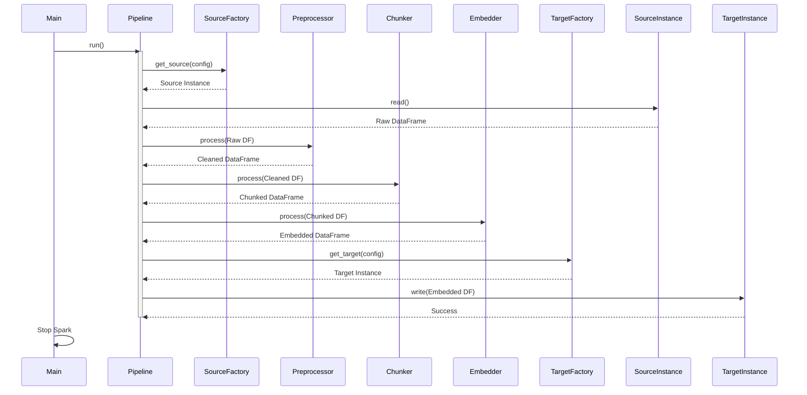
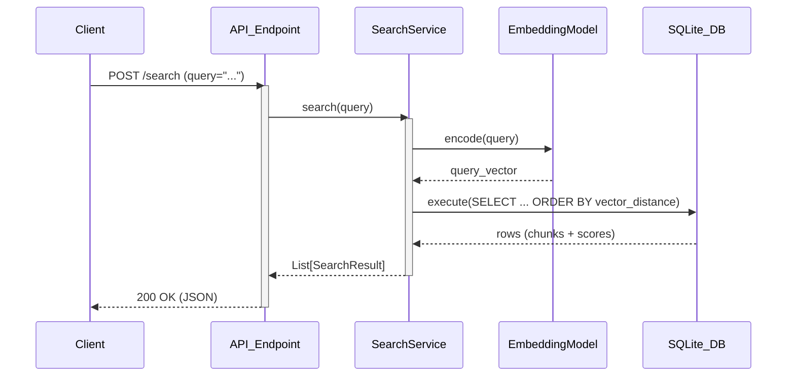
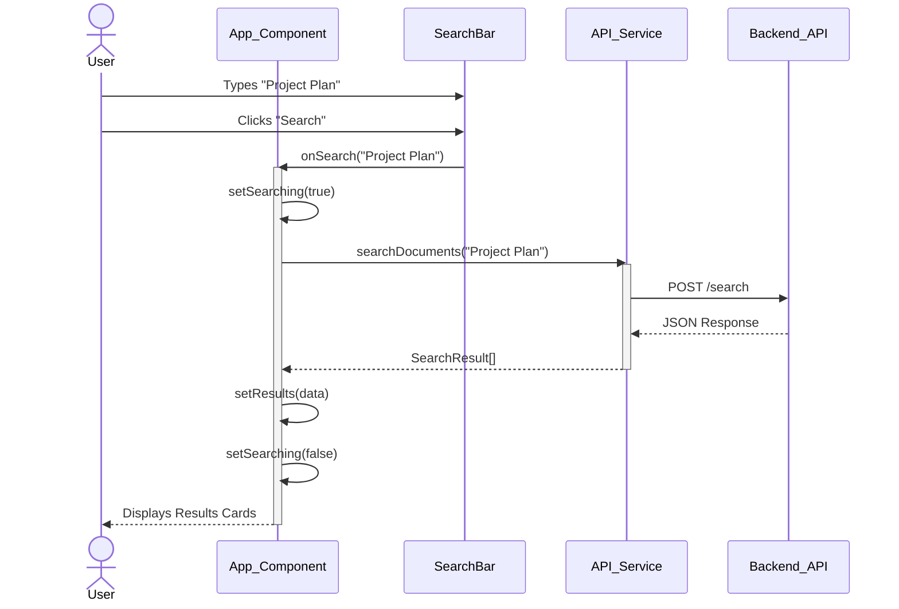
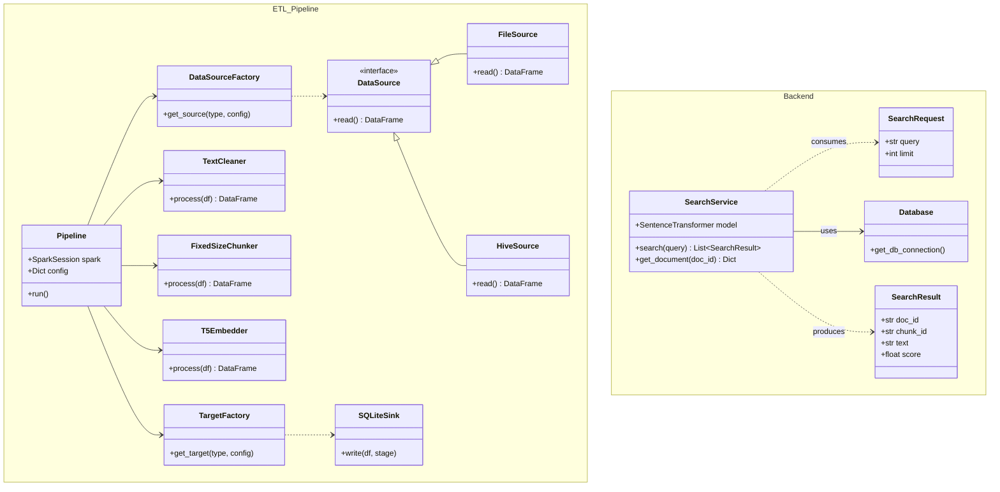

# System Architecture

This document provides high-level diagrams for the NLP ETL Pipeline, Backend API, and Frontend Application.

## 1. ETL Pipeline

### 1.1 High-Level Process Flow
```mermaid
graph TD
    Start([Start]) --> Config[Load Configuration]
    Config --> InitSpark[Initialize Spark Session]
    InitSpark --> SourceDecide{Source Type?}
    
    SourceDecide -- Hive --> HiveSource[Read from Hive]
    SourceDecide -- File --> FileSource[Read from CSV/JSON]
    
    HiveSource --> Preprocess[Preprocessing\n(Clean Text, Remove URLs)]
    FileSource --> Preprocess
    
    Preprocess --> Chunking[Chunking\n(Fixed Size + Smoothing)]
    Chunking --> Embedding[Embedding Generation\n(Sentence-T5-Base)]
    
    Embedding --> Targets{Save Targets}
    Targets --> Local[Local Storage\n(Pickle/Parquet)]
    Targets --> SQLite[SQLite Vector DB\n(Data + Embeddings)]
    
    Local --> Stop([End])
    SQLite --> Stop
```

### 1.2 High-Level Sequence Diagram


## 2. Backend API

### 2.1 High-Level Process Flow
```mermaid
graph TD
    Request([Client Request]) --> Router[FastAPI Router]
    Router --> RouteDecide{Route?}
    
    RouteDecide -- POST /search --> SearchService[Search Service]
    SearchService --> Embed[Embed Query\n(Sentence-T5)]
    Embed --> VectorSearch[Vector Search\n(Cosine Similarity in SQLite)]
    VectorSearch --> Format[Format Results]
    Format --> Response([Return JSON])
    
    RouteDecide -- GET /document/{id} --> DocService[Document Service]
    DocService --> DBQuery[Query SQLite by ID]
    DBQuery --> DocResponse([Return Document])
```

### 2.2 High-Level Sequence Diagram


## 3. Frontend Application

### 3.1 High-Level Process Flow
```mermaid
graph TD
    UserOpen([User Opens App]) --> Render[Render App Component]
    Render --> RenderSearch[Render SearchBar]
    Render --> RenderGrid[Render ResultsGrid]
    
    UserAction{User Action}
    
    UserAction -- Type Query --> InputState[Update Query State]
    UserAction -- Click Search --> CallAPI[Call searchDocuments()]
    
    CallAPI --> Overlay[Show Loading Overlay]
    Overlay --> Axios[Axios POST /search]
    Axios --> Receive[Receive Data]
    Receive --> UpdateResults[Update Results State]
    UpdateResults --> HideOverlay[Hide Overlay]
    HideOverlay --> ReRenderGrid[Re-Render ResultsGrid]
    
    UserAction -- Click Result --> OpenViewer[Open DocumentViewer]
    OpenViewer --> FetchDoc[Call getDocument()]
    FetchDoc --> ShowDoc[Display Full Text]
```

### 3.2 High-Level Sequence Diagram


## 4. Class Diagrams

### 4.1 ETL Pipeline & Backend Classes

